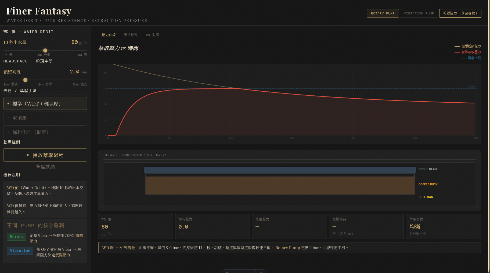
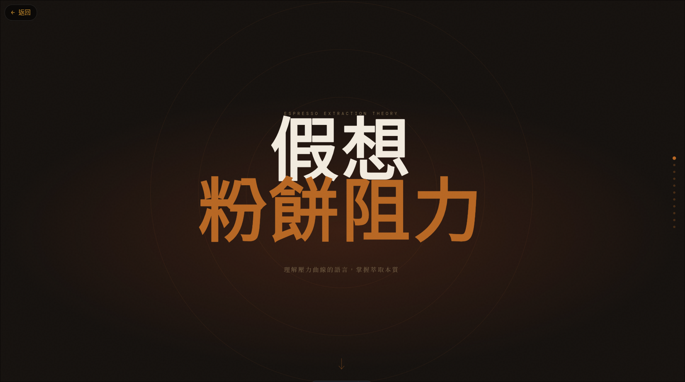

# Finer Fantasy - Espresso 萃取物理模擬器

### 主畫面 (Main Simulator)


### 概念導覽 (Concept Interactive Guide)



## ☕ 關於專案 (The Origins)


「為什麼要叫 **Finer Fantasy**？」

這不僅是對經典 RPG *Final Fantasy* 的致敬，更是無數咖啡職人對那一杯「完美濃縮」的終極幻想。在咖啡界，有一個傳說中的解決方案：「**Grind Finer** (磨細一點)」。這個專案，就是將這場關於「研磨」與「萃取」的浪漫幻想，轉化為精確的物理模擬。

### 建立你的「物理直覺」與心智表徵

在實際的咖啡沖煮中，**WD 值 (Water Debit, 出水量)** 與 **Headspace (粉頂空間)** 往往是極其抽象的概念。我們很難直接觀察到水流在填壓後的粉餅內部是如何移動的，且並非每一台義式咖啡機都能顯示即時的萃取壓力或流速。

**Finer Fantasy** 引入了「**假想粉餅阻力** (Fictitious Puck Resistance)」的概念，這是一個連結「現象」與「物理」的橋樑：
- **視覺化不可見之物**：透過模擬水流穿過粉餅時的動態阻力，幫助你在腦中建構出一個清晰的**心智表徵**。
- **更有感的萃取環節**：當你調整填壓力度、佈粉方式或機器參數時，你能即時看到模擬曲線的反應，進而讓你在實際操作（填壓、佈粉、觀察流速）時，對每一個細微動作所產生的物理意義「更有感」。


## 🌟 核心特色

- **靈魂機器模擬**：
  - **Rotary Pump (旋轉泵)**：穩定的壓力，職人的精準。
  - **Vibration Pump (震動泵)**：具有生命力的微細脈動。
- **物理參數的華麗舞步**：
  - **WD (Water Debit)**：10 秒出水量如何左右壓力的爬升？
  - **Headspace (粉頂空間)**：揭開「自然預浸」的延遲美學。
  - **偏流 (Channeling) 模擬**：體驗「佈粉不均」與「阻力崩潰」對萃取帶來的致命傷。
- **數據與視覺的交織**：
  - 即時 Canvas 渲染，捕捉每一毫秒的壓力起伏。
  - 支援動態播放，像觀看一部微型物理紀錄片。

## 🧭 導覽：假想粉餅阻力互動網頁

想要更深入地理解物理細節嗎？我們準備了一個專屬的 **[教育導覽頁面](./src/pages/learning.astro)**。

在這個由 **GSAP** 驅動的互動頁面中，你可以透過滾動來觀看：
1. **水滴的舞動**：水穿過粉餅的物理模型分解。
2. **阻力曲線分析**：不同壓力和手法下的物理反應。
3. **從 0 到 9 bar**：完整的萃取過程。

> [!TIP]
> 建議在桌面端開啟，體驗最流暢的滾動視覺衝擊。

## 🛠️ 技術棧

- **Frontend**: [Astro](https://astro.build/) - 打造極速的開發與運行體驗。
- **Animation**: [GSAP](https://greensock.com/gsap/) - 驅動細膩的互動導覽。
- **Graphics**: 原生 Canvas API - 追求無懈可擊的效能。

## 🚀 立即啟動

```bash
# 克隆本專案
git clone https://github.com/alvin999/finer-fantasy.git

# 安裝依賴
npm install

# 啟動開發伺服器
npm run dev
```

---
*Powered by Coffee, Code, and the never-ending dream of a perfect shot.*

